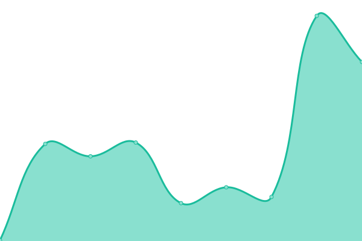

# [📈 Live Status](https://staging.reachlink.com): <!--live status--> **🟧 Partial outage**

This repository contains the open-source uptime monitor and status page for [neebs](https://staging.reachlink.com), powered by [Upptime](https://github.com/upptime/upptime).

With [Upptime](https://upptime.js.org), you can get your own unlimited and free uptime monitor and status page, powered entirely by a GitHub repository. We use [Issues](https://github.com/copypastemaster/legendary-fortnight/issues) as incident reports, [Actions](https://github.com/copypastemaster/legendary-fortnight/actions) as uptime monitors, and [Pages](https://staging.reachlink.com) for the status page.

<!--start: status pages-->
<!-- This summary is generated by Upptime (https://github.com/upptime/upptime) -->
<!-- Do not edit this manually, your changes will be overwritten -->
<!-- prettier-ignore -->
| URL | Status | History | Response Time | Uptime |
| --- | ------ | ------- | ------------- | ------ |
|  [ReachLink Staging](https://staging.reachlink.com) | 🟩 Up | [reach-link-staging.yml](https://github.com/copypastemaster/legendary-fortnight/commits/HEAD/history/reach-link-staging.yml) | 

 167ms
     
 | 

<a href="https://copypastemaster.github.io/legendary-fortnight/history/reach-link-staging">100.00%</a>
    

|  [ReachLink Staging Backend](https://reachlink-backend-staging.herokuapp.com) | 🟥 Down | [reach-link-staging-backend.yml](https://github.com/copypastemaster/legendary-fortnight/commits/HEAD/history/reach-link-staging-backend.yml) | 

 132ms
     
 | 

<a href="https://copypastemaster.github.io/legendary-fortnight/history/reach-link-staging-backend">4.21%</a>
    

|  [ReachLink Dev](https://reachlink-frontend-dev-c13e719bdbb8.herokuapp.com/main/dashboard) | 🟩 Up | [reach-link-dev.yml](https://github.com/copypastemaster/legendary-fortnight/commits/HEAD/history/reach-link-dev.yml) | 

 141ms
     
 | 

<a href="https://copypastemaster.github.io/legendary-fortnight/history/reach-link-dev">100.00%</a>
    

|  [ReachLink Dev Backend](https://reachlink-backend-dev-96519c75ba4f.herokuapp.com) | 🟥 Down | [reach-link-dev-backend.yml](https://github.com/copypastemaster/legendary-fortnight/commits/HEAD/history/reach-link-dev-backend.yml) | 

 129ms
     
 | 

<a href="https://copypastemaster.github.io/legendary-fortnight/history/reach-link-dev-backend">0.73%</a>
    

<!--end: status pages-->

[**Visit our status website →**](https://copypastemaster.github.io/legendary-fortnight)

## 📄 License

- Powered by: [Upptime](https://github.com/upptime/upptime)
- Code: [MIT](./LICENSE) © [Anand Chowdhary](https://anandchowdhary.com), supported by [Pabio](https://pabio.com)
- Data in the `./history` directory: [Open Database License](https://opendatacommons.org/licenses/odbl/1-0/)
